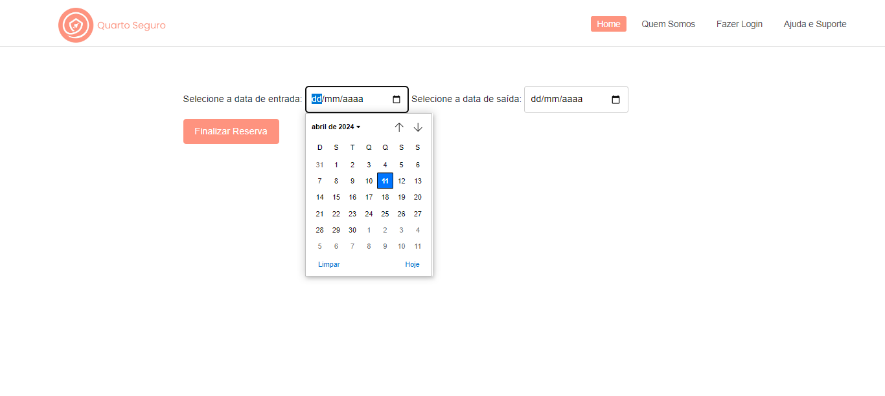

## Sistema de reserva de hotel

Este é um sistema de reserva de hotel que permite aos usuários selecionar hotéis, quartos, datas de entrada e saída, e fazer cadastros. O sistema registra as informações do usuário e as vincula com os dados da reserva em um banco de dados.

## Ferramentas utilizadas:

* HTML

* CSS

* Java

* Servlet

* Apache Tomcat

* JSP

* JDBC

## Feito por:

### Ketlyn